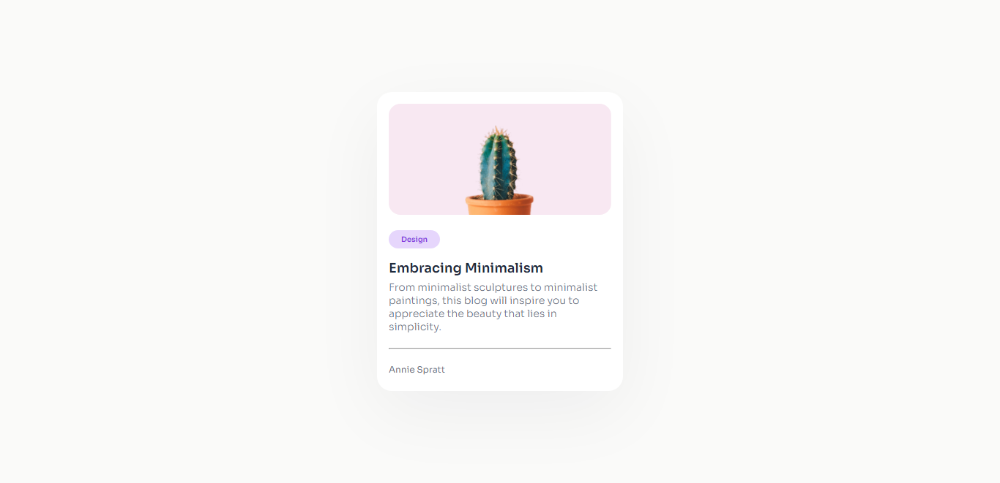
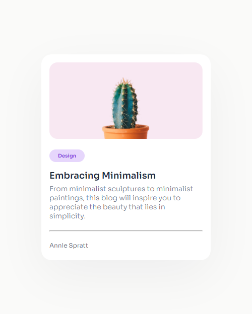

<!-- Please update value in the {}  -->

<h1 align="center">Mini Blog Card</h1>

<div align="center">
   Solution for a challenge from  <a href="http://devchallenges.io" target="_blank">Devchallenges.io</a>.
</div>

<div align="center">
  <h3>
    <a href="https://sharjeel234.github.io/mini-blog-card">
      Demo
    </a>
    <span> | </span>
    <a href="https://github.com/Sharjeel234/mini-blog-card">
      Solution
    </a>
    <span> | </span>
    <a href="https://devchallenges.io/challenge/27">
      Challenge
    </a>
  </h3>
</div>

<!-- TABLE OF CONTENTS -->

## Table of Contents

- [Overview](#overview)
  - [Built With](#built-with)
- [Features](#features)
- [How to use](#how-to-use)
- [Contact](#contact)

<!-- OVERVIEW -->

## Overview

### Desktop Preview



### Mobile Preview



### Built With

- HTML
- CSS

## Features

This application/site was created as a submission to a [DevChallenges](https://devchallenges.io/challenges) challenge. The [challenge](https://devchallenges.io/challenge/27) was to build an application to complete the given user stories.

## How To Use

To clone and run this application, you'll need [Git](https://git-scm.com) and [Node.js](https://nodejs.org/en/download/) (which comes with [npm](http://npmjs.com)) installed on your computer. From your command line:

```bash
# Clone this repository
$ git clone https://github.com/Sharjeel234/mini-blog-card.git
```

## Contact

- GitHub [@Sharjeel234](https://github.com/Sharjeel234)
- Twitter [@SharjeelM786](https://twitter.com/SharjeelM786)
- LinkedIn [Sharjeel Mansoor](https://linkedin.com/in/sharjeel-mansoor)
